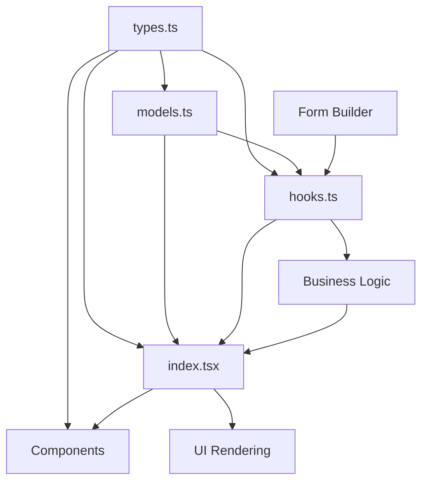

# Grade Creation System - Architecture Documentation

## 📁 **Clean Architecture Overview**

This directory contains the complete Grade Creation system built with a clean, maintainable architecture:

```
📁 src/pages/create/
├── 📋 models.ts      # Form field configurations and data models
├── 🔧 hooks.ts       # Business logic and form state management
├── 🎨 index.tsx      # UI rendering and component composition
├── 📐 types.ts       # TypeScript interfaces and type definitions
└── 📚 README.md      # This architecture documentation
```

---

## 🎯 **Architecture Principles**

### **Separation of Concerns**

- **`types.ts`**: All TypeScript type definitions and interfaces
- **`models.ts`**: Field configurations, default data, and static definitions
- **`hooks.ts`**: Business logic, form state management, and validation
- **`index.tsx`**: Pure UI presentation and user interaction

### **Type Safety**

- **100% TypeScript**: All components are fully typed
- **Centralized Types**: All interfaces defined in `types.ts`
- **Import Strategy**: Uses `import type` for type-only imports
- **Interface Consistency**: Shared types across all components

### **Reusability**

- **Modular Components**: Each file has a single responsibility
- **Exported Interfaces**: Types can be reused across the application
- **Configuration-Driven**: Models drive the UI behavior
- **Composable Architecture**: Easy to extend and modify

---

## 📐 **Type System Architecture**

### **Core Interfaces**

#### **`ChemicalElement`**

```typescript
interface ChemicalElement {
  symbol: string; // Element symbol (C, Si, etc.)
  bathMin: number; // Bath chemistry minimum
  bathMax: number; // Bath chemistry maximum
  finalMin: number; // Final chemistry minimum
  finalMax: number; // Final chemistry maximum
}
```

#### **`Material`**

```typescript
interface Material {
  name: string;
  type: 'Furnace' | 'Additives' | 'Nodularizer';
  minPercent: number;
  maxPercent: number;
  selected: boolean;
}
```

#### **`ToleranceSettings`**

```typescript
interface ToleranceSettings {
  element: string;
  baseMin: number;
  baseMax: number;
  toleranceMin: number;
  toleranceMax: number;
}
```

#### **`GradeFormData`** (Main Form Interface)

```typescript
interface GradeFormData {
  selectedModules: string[];
  tagId: string;
  gradeName: string;
  gradeCode: string;
  gradeType: 'DI' | 'CI' | 'SS' | 'SG' | 'GI';
  tappingTemperatureMin: number;
  tappingTemperatureMax: number;
  mgTreatmentTime: number;
  bathChemistryDecision: 'with' | 'without';
  rememberChoice: boolean;
  spectroEnabled: boolean;
  chargemixEnabled: boolean;
  chemistryElements: ChemicalElement[];
  materials: Material[];
  toleranceSettings: ToleranceSettings[];
}
```

### **Supporting Types**

- **`ModuleInfo`**: Module metadata and business information
- **`ModuleInfoMap`**: Type-safe module information mapping
- **`GradeType`**: Enum for grade type values
- **`MaterialType`**: Enum for material categories
- **`BathChemistryDecision`**: Enum for bath chemistry options
- **`ValidationError`**: Error handling structure
- **`FieldGroupKey`**: Type-safe field group identifiers

---

## 🏗️ **Component Integration**

### **Type Import Strategy**

```typescript
// ✅ Correct: Type-only imports
import type { ChemicalElement, Material } from './types';

// ✅ Correct: Value imports for data/functions
import { gradeFormModel, defaultGradeData } from './models';
```

### **Cross-Component Usage**

All components that use the grade creation types import from `./types`:

- **`ChemistryTable.tsx`** → Uses `ChemicalElement`
- **`MaterialSelection.tsx`** → Uses `Material`
- **`ToleranceSettings.tsx`** → Uses `ToleranceSettings`
- **`ModuleSelectionCard.tsx`** → Uses `ModuleInfoMap`
- **`hooks.ts`** → Uses all interfaces for form management
- **`index.tsx`** → Uses core interfaces for props and state

---

## 🔄 **Data Flow Architecture**



### **Flow Description**

1. **`types.ts`** defines all interfaces and types
2. **`models.ts`** imports types and creates form configurations
3. **`hooks.ts`** imports types and models to manage business logic
4. **`index.tsx`** imports types and hooks to render the UI
5. **Components** import types for prop validation and consistency

---

## 🧪 **Testing Strategy**

### **Type Safety Testing**

- **Compile-Time Validation**: TypeScript catches type mismatches
- **Interface Compliance**: All props match defined interfaces
- **Import Validation**: Only necessary types are imported

### **Build Verification**

```bash
npm run build  # Verifies all types compile correctly
npm run dev    # Tests runtime type compatibility
```

---

## 🚀 **Extension Guidelines**

### **Adding New Types**

1. **Define in `types.ts`**: Add the new interface/type
2. **Update `models.ts`**: Add related field configurations
3. **Extend `hooks.ts`**: Add business logic if needed
4. **Update `index.tsx`**: Add UI rendering if required

### **Type Modification**

1. **Update `types.ts`**: Modify the interface
2. **Check imports**: Ensure all imports remain valid
3. **Update usage**: Modify consuming code as needed
4. **Test build**: Verify TypeScript compilation

### **Component Integration**

1. **Import types**: Use `import type` for interfaces
2. **Define props**: Extend from main interfaces
3. **Type safety**: Ensure all props are properly typed
4. **Validation**: Add runtime validation if needed

---

## 📊 **Architecture Benefits**

### **✅ Developer Experience**

- **Autocomplete**: Full IDE support with type hints
- **Error Prevention**: Compile-time error catching
- **Documentation**: Types serve as living documentation
- **Refactoring**: Safe and reliable code refactoring

### **✅ Maintainability**

- **Single Source**: All types defined in one place
- **Consistency**: Shared interfaces across components
- **Scalability**: Easy to add new features and types
- **Clarity**: Clear separation of concerns

### **✅ Production Quality**

- **Type Safety**: 100% TypeScript coverage
- **Performance**: Optimized build with tree shaking
- **Reliability**: Compile-time validation prevents runtime errors
- **Documentation**: Self-documenting through types

---

## 🎯 **Best Practices**

### **Import Guidelines**

```typescript
// ✅ Correct: Type-only imports
import type { GradeFormData } from './types';

// ✅ Correct: Combined imports
import { defaultGradeData } from './models';
import type { ChemicalElement } from './types';

// ❌ Avoid: Mixing value and type imports
import { GradeFormData, defaultGradeData } from './models';
```

### **Interface Design**

```typescript
// ✅ Correct: Specific, focused interfaces
interface ChemicalElement {
  symbol: string;
  bathMin: number;
  bathMax: number;
  finalMin: number;
  finalMax: number;
}

// ❌ Avoid: Large, unfocused interfaces
interface EverythingData {
  // Too many unrelated properties
}
```

### **Type Exports**

```typescript
// ✅ Correct: Export interfaces and types
export interface ChemicalElement { ... }
export type GradeType = 'DI' | 'CI' | 'SS';

// ✅ Correct: Type alias for complex types
export type ModuleInfoMap = {
  readonly [K in 'SPECTRO' | 'IF_KIOSK']: ModuleInfo;
};
```

---

_This architecture provides a solid foundation for building scalable, maintainable, and type-safe React applications with sophisticated form management capabilities._
